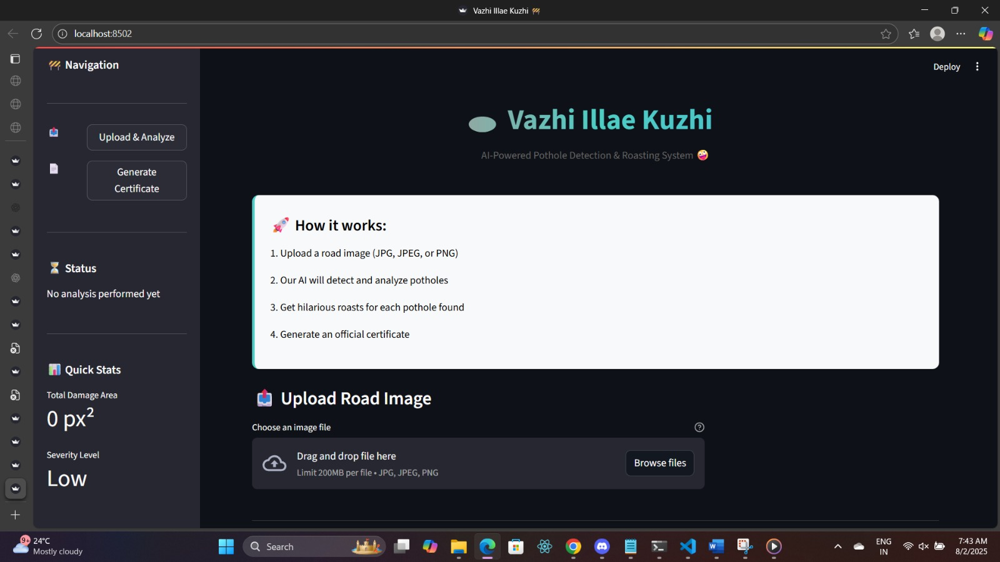
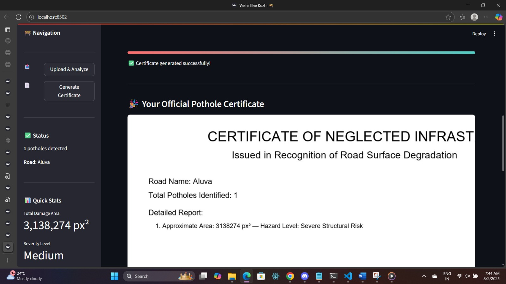

# [Vazhi-Illae-Kuzhi] 🎯

## Basic Details
### Team Name: [2 Musketeers]

### Team Members
- Team Lead: [Anamika M J] - [Model Enginnering College]
- Member 2: [Anamika M J] - [Model Enginnering College]
- Member 3: [Riya Rebecca Renjit] - [Model Enginnering College]

### Project Description
[*Vazhi Illae Kuzhi* is a quirky and smart pothole detection app built using *OpenCV* and *Streamlit*. Just upload a road photo, and the app detects potholes by analyzing their shape and size.

What makes it stand out? Humor. Instead of just pointing out potholes, it roasts them with hilarious, sarcastic comments—turning frustration into fun.

And for a final touch, it creates a personalized *“Pothole Certificate”* highlighting the detected pothole, ready to download or share. It's a fun way to raise awareness about bad roads while having a laugh.

Perfect for civic-minded users, tech lovers, or anyone tired of bumpy rides, Vazhi Illae Kuzhi blends technology and local flavor for a smart, entertaining road-safety tool.]

### The Problem (that doesn't exist)
[India (and many other countries) face a serious road safety issue due to unidentified or poorly maintained potholes.]

### The Solution (that nobody asked for)
[Vazhi Illae Kuzhi offers a creative and tech-powered way to detect and highlight potholes from road images using OpenCV. The solution works in four key steps:

🧠 Automated Detection:
It uses computer vision techniques to identify potholes based on their contour shapes, depth-like shadows, and area size — no manual marking required.

🎯 Visual Feedback:
Detected potholes are highlighted with contours on the image, giving users a clear, visual representation of road damage.

🤣 Humor-Driven Engagement:
The app generates funny roast messages based on the pothole size and severity — making the experience light-hearted but attention-grabbing.

📝 Sharable Pothole Certificate:
Users get a custom “Pothole Certificate” that summarizes the number, size, and danger level of detected potholes — perfect for sharing or tagging civic authorities.]

## Technical Details
### Technologies/Components Used
For Software:
- [Python]
- [Streamlit (for web UI)]
- - [OpenCV (for image processing and contour detection)
,NumPy (for numerical operations),Pillow / PIL (for image handling and certificate generation),random, datetime (Python standard libraries for roast/certificate logic)]
- [Git & GitHub (for version control and collaboration),VS Code (for development)
,ChatGPT (for code assistance, brainstorming, and optimization)]

### Implementation
For Software:
# Installation
[# Clone the repository
git clone https://github.com/your-username/vazhi-illae-kuzhi.git
cd vazhi-illae-kuzhi

# (Optional) Create a virtual environment
python -m venv venv
source venv/bin/activate        # On Windows: venv\Scripts\activate

# Install required dependencies
pip install -r requirements.txt]

# Run
[streamlit run app/streamlit_app.py]

### Project Documentation
For Software:Upload road images for pothole detection

View image processing stages (grayscale, contours, final)

Roast messages generated based on pothole size

Pothole Certificate with stats and road hazard level

Download or share the certificate

# Screenshots (Add at least 3)

*Detection of Potholes*

*Cover Page*

*Certificate*

# Diagrams

*Add caption explaining your workflow*

### Project Demo
# Video
[1c90a964-8465-43e4-9b0b-82e908f0706d.jpg]
*Explain what the video demonstrates*

## Team Contributions
- [Riya Rebecca Renjit]: [Frontend]
- [Anamika M J]: [OpenCV]

---
Made with ❤️ at TinkerHub Useless Projects 

